# Web-Application-using-Auto-Scaling-and-Load-Balancer

## Project Overview

This project demonstrates how to design and deploy a highly available
web application on AWS using an **Application Load Balancer (ALB)**,
**EC2 Auto Scaling Group (ASG)**, **CloudWatch**, and **Multi-AZ
deployment**.

The architecture is designed to distribute incoming traffic across
multiple EC2 instances and automatically adjust the number of instances
according to CPU utilization.

## Objectives

-   Deploy a highly available web application.
-   Distribute traffic using an Application Load Balancer.
-   Run EC2 instances across multiple Availability Zones.
-   Automatically maintain a minimum number of healthy instances.
-   Automatically scale out when CPU utilization increases.
-   Automatically scale in when demand decreases.
-   Verify application health using Target Group health checks.
-   Test load balancing and instance failure recovery.

------------------------------------------------------------------------

## AWS Services Used

  Service                     Purpose
  --------------------------- -----------------------------------------------
  Amazon VPC                  Network isolation
  EC2                         Web server instances
  Application Load Balancer   Distribute HTTP traffic
  Auto Scaling Group          Maintain and automatically scale EC2 capacity
  Target Group                Register instances and perform health checks
  CloudWatch                  Monitor CPU utilization and scaling metrics
  Security Groups             Control network access
  AMI                         Create a reusable web-server image

------------------------------------------------------------------------

## Final Architecture

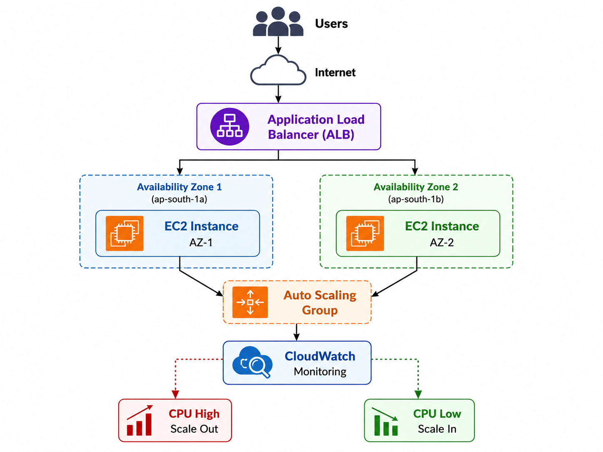

### High Availability Strategy

The application uses two Availability Zones so that the application is
not dependent on a single EC2 instance or a single Availability Zone.

The Application Load Balancer sends traffic only to healthy targets. The
Auto Scaling Group maintains the required number of instances and
replaces unhealthy or terminated instances.

------------------------------------------------------------------------

# Implementation Steps

## Step 1 --- Create ALB Security Group

Create a security group named:

``` text
ALB-SG
```

### Inbound Rule

  Type     Port Source
  ------ ------ -----------
  HTTP       80 0.0.0.0/0

Outbound traffic:

``` text
All traffic
```

### Screenshot

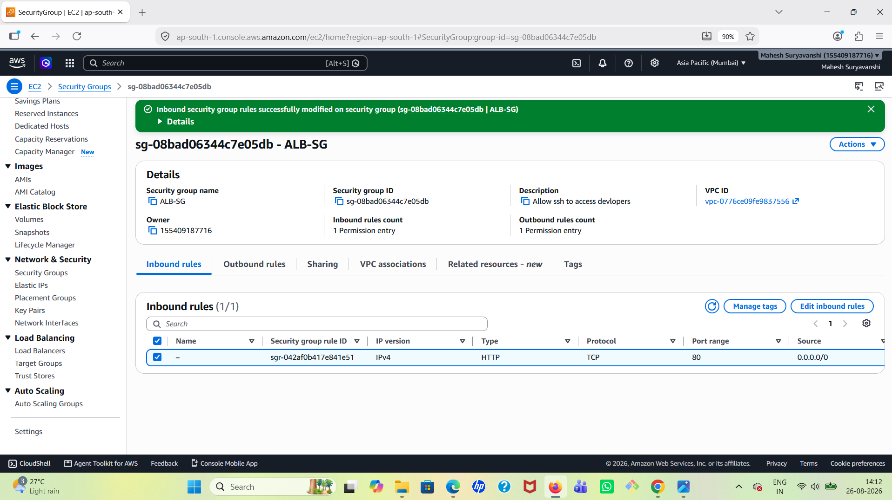

------------------------------------------------------------------------

## Step 2 --- Create EC2 Security Group

Create:

``` text
WebServer-SG
```

### Inbound Rules

  Type     Port Source
  ------ ------ --------
  HTTP       80 ALB-SG
  SSH        22 My IP

The EC2 HTTP port is restricted to the ALB security group instead of
allowing HTTP from the entire internet.

### Screenshot

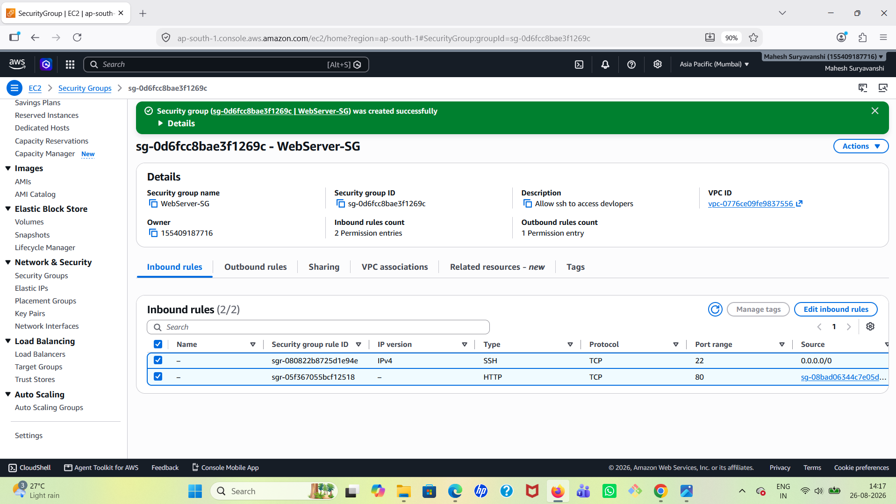

------------------------------------------------------------------------

## Step 3 --- Launch Base EC2 Instance

Launch an EC2 instance with:

``` text
Name: WebServer-Base
AMI: Ubuntu Linux 2023
Instance Type: t3.micro
Key Pair: Your-Key
Security Group: WebServer-SG
```

This instance is used as the base server from which the AMI is created.

### Screenshot

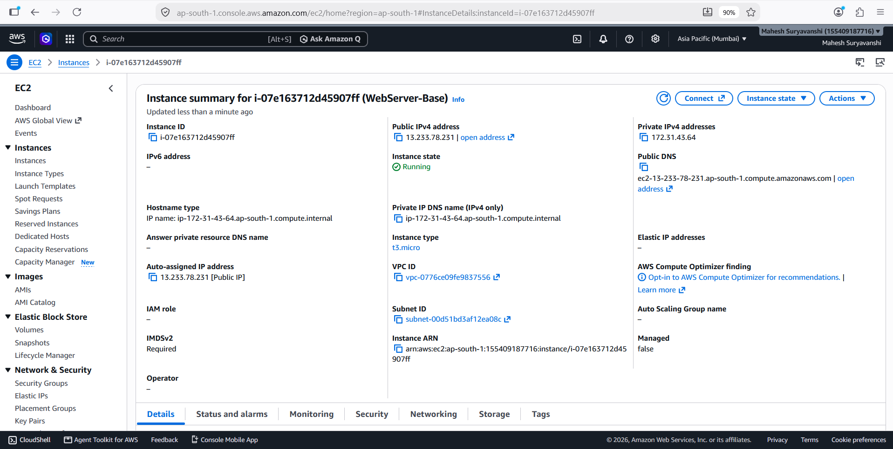

------------------------------------------------------------------------

## Step 4 --- Connect to EC2

Connect using EC2 Instance Connect or SSH.

Example:

``` bash
ssh -i your-key.pem ec2-user@PUBLIC-IP
```

------------------------------------------------------------------------

## Step 5 --- Install Apache

Update packages:

``` bash
sudo apt update -y
```

Install Nginx:

``` bash
sudo dnf install nginx -y
```

Start Nginx:

``` bash
sudo systemctl start nginx
```

Enable Nginx at boot:

``` bash
sudo systemctl enable nginx
```

Check status:

``` bash
sudo systemctl status nginx
```

Expected status:

``` text
Active: active (running)
```

### Screenshot


------------------------------------------------------------------------

## Step 6 --- Create Demo Website

Create the application page:

``` bash
#!/bin/bash

# Update and upgrade packages
apt-get update -y
apt-get upgrade -y

# Install Python and Nginx
apt-get install -y python3 python3-pip nginx

# Get instance metadata
TOKEN=$(curl -sX PUT "http://169.254.169.254/latest/api/token" \
  -H "X-aws-ec2-metadata-token-ttl-seconds: 21600")

PRIVATE_IP=$(curl -s \
  -H "X-aws-ec2-metadata-token: $TOKEN" \
  http://169.254.169.254/latest/meta-data/local-ipv4)

INSTANCE_ID=$(curl -s \
  -H "X-aws-ec2-metadata-token: $TOKEN" \
  http://169.254.169.254/latest/meta-data/instance-id)

# Create a dynamic HTML page
cat > /var/www/html/index.html <<EOF
<!DOCTYPE html>
<html>
<head>
    <title>Cravita Load Balancer Demo</title>
    <style>
        body {
            font-family: Arial, sans-serif;
            text-align: center;
            margin-top: 100px;
        }
        h1 {
            color: #232f3e;
        }
        .server {
            font-size: 24px;
            margin: 20px;
            padding: 20px;
            border: 2px solid #232f3e;
            border-radius: 10px;
            display: inline-block;
        }
    </style>
</head>

<body>

    <h1>Cravita Load Balancer Demo</h1>

    <div class="server">
        <h2>Backend Server</h2>

        <p><strong>Private IP:</strong> $PRIVATE_IP</p>

        <p><strong>Instance ID:</strong> $INSTANCE_ID</p>

    </div>

</body>
</html>
EOF

# Start Nginx
systemctl start nginx

# Enable Nginx at boot
systemctl enable nginx

# Restart Nginx
systemctl restart nginx
```

Test using:

``` text
http://PUBLIC-IP
```

### Screenshot

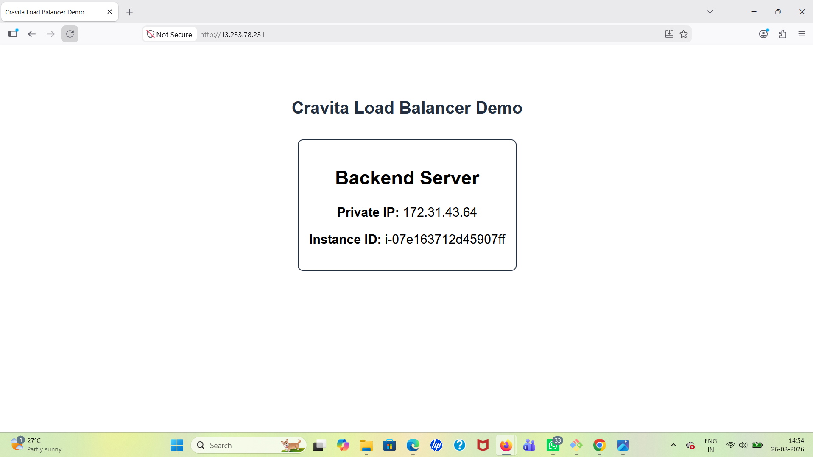

------------------------------------------------------------------------

## Step 7 --- Create AMI

Create an AMI from the configured EC2 instance.

Path:

``` text
EC2 → Instances → Select Instance
→ Actions → Image and templates → Create image
```

AMI name:

``` text
WebServer-AMI
```

Wait until the AMI becomes available.

### Screenshot

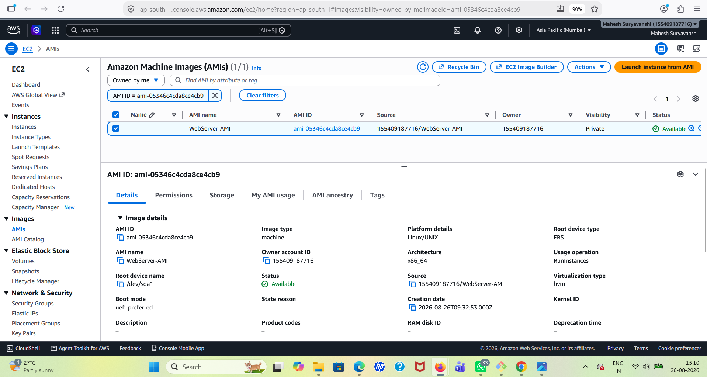

------------------------------------------------------------------------

## Step 8 --- Create Launch Template

Create:

``` text
WebServer-Template
```

Configuration:

``` text
AMI: WebServer-AMI
Instance Type: t3.micro
Key Pair: Your-Key
Security Group: WebServer-SG
```

The Auto Scaling Group will use this Launch Template to create new
instances.

### Screenshot

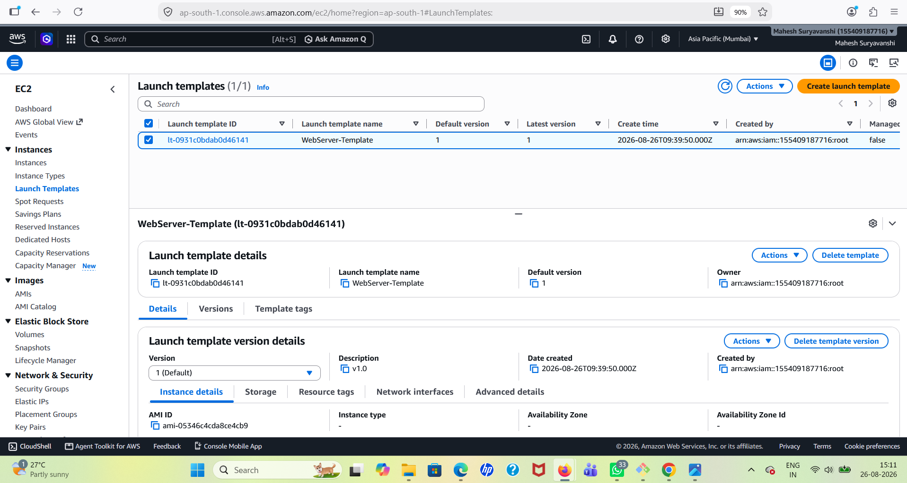

------------------------------------------------------------------------

## Step 9 --- Create Target Group

Create a target group:

``` text
Name: Web-TG
Target Type: Instances
Protocol: HTTP
Port: 80
```

Health check:

``` text
Protocol: HTTP
Path: /
```

The target group will be attached to the ALB and ASG.

### Screenshot

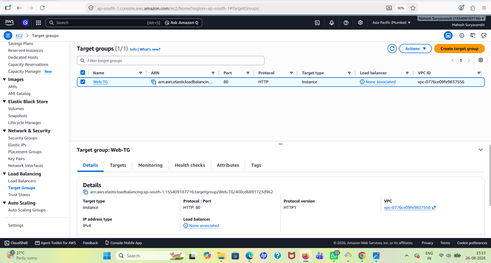

------------------------------------------------------------------------

## Step 10 --- Create Application Load Balancer

Create:

``` text
Name: Web-ALB
Scheme: Internet-facing
IP address type: IPv4
```

Select the VPC and at least two subnets in different Availability Zones.

Example:

``` text
ap-south-1a
ap-south-1b
```

Security Group:

``` text
ALB-SG
```

Listener:

``` text
HTTP : 80
```

Forward traffic to:

``` text
Web-TG
```

### Screenshot


------------------------------------------------------------------------

## Step 11 --- Create Auto Scaling Group

Create:

``` text
Name: Web-ASG
Launch Template: WebServer-Template
```

Select the same VPC and two Availability Zones.

Attach the existing target group:

``` text
Web-TG
```

Enable:

``` text
Elastic Load Balancing health checks
```

### Group Size

``` text
Desired capacity: 2
Minimum capacity: 2
Maximum capacity: 4
```

### Screenshot

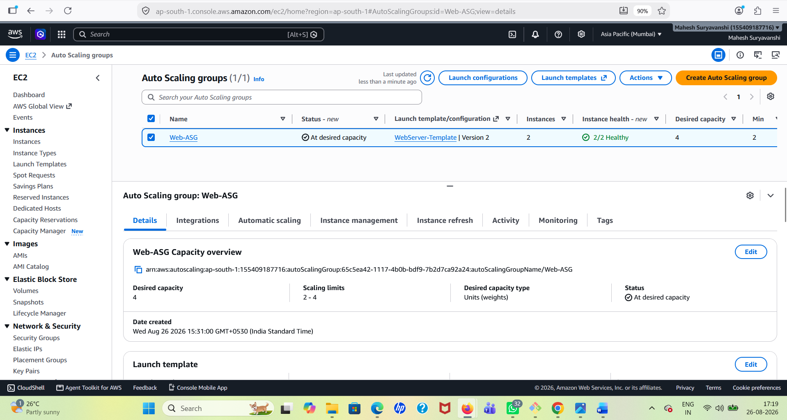

------------------------------------------------------------------------

## Step 12 --- Verify Two EC2 Instances

After the ASG is created, two EC2 instances should be launched
automatically.

Expected:

``` text
WebServer-1    Running
WebServer-2    Running
```

### Screenshot

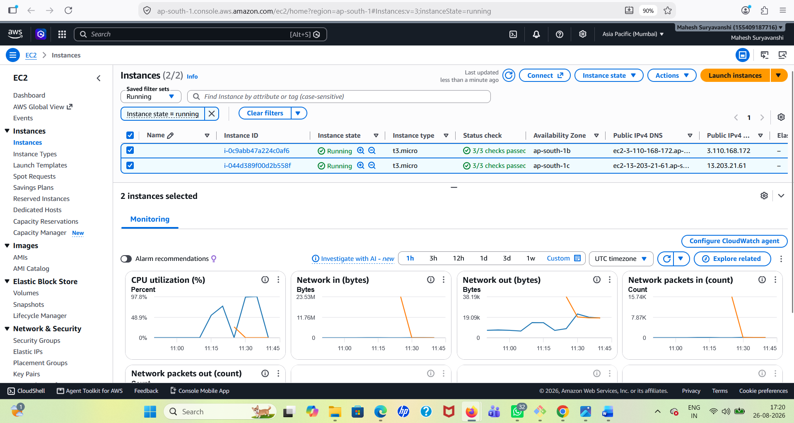

------------------------------------------------------------------------

## Step 13 --- Verify Target Health

Go to:

``` text
EC2 → Target Groups → Web-TG → Targets
```

Expected:

``` text
Target 1 → Healthy
Target 2 → Healthy
```

### Screenshot

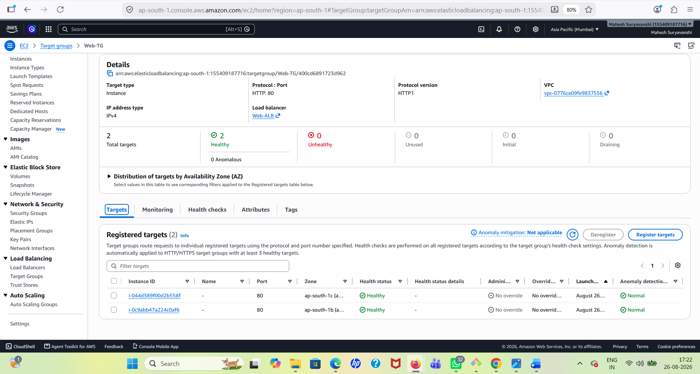

------------------------------------------------------------------------

## Step 14 --- Test Application Through ALB

Copy the ALB DNS name and open:

``` text
http://YOUR-ALB-DNS-NAME
```

The application should load through the Load Balancer.

### Screenshot

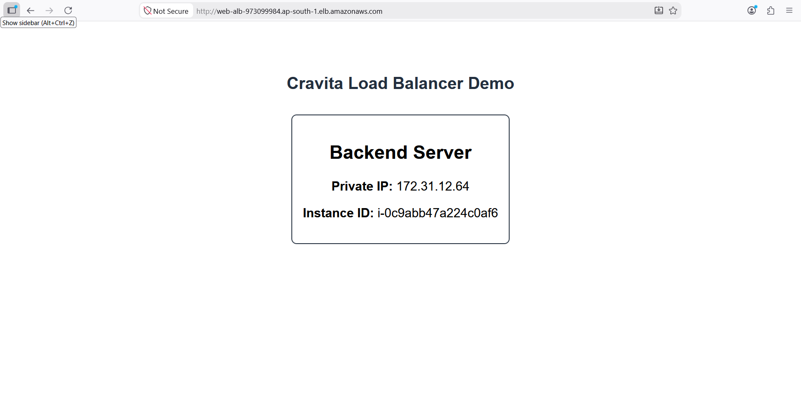

------------------------------------------------------------------------

## Step 15 --- Test Load Balancing

For better verification, display the EC2 instance ID and Availability
Zone on the application page.

Refresh the ALB URL multiple times.

Example:

``` text
Request 1
Instance: i-123456
AZ: ap-south-1a
```

Another request may show:

``` text
Request 2
Instance: i-789012
AZ: ap-south-1b
```

This demonstrates that the ALB is distributing requests across healthy
targets.

### Screenshot

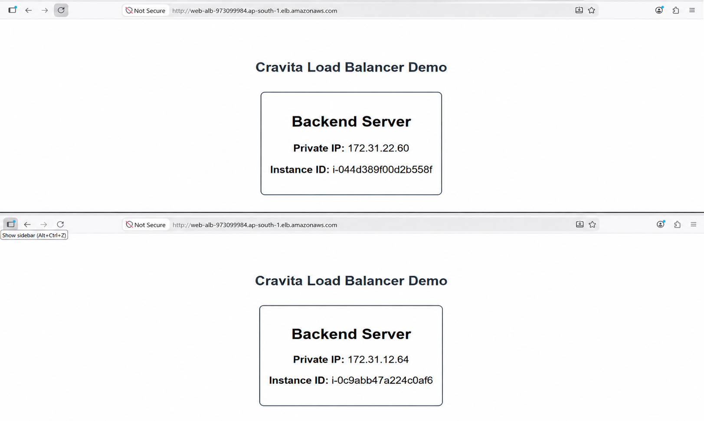

------------------------------------------------------------------------

## Step 16 --- Configure Auto Scaling Policy

Open:

``` text
EC2 → Auto Scaling Groups → Web-ASG
```

Create a dynamic scaling policy.

Use:

``` text
Policy Type: Target Tracking Scaling
Metric: Average CPU Utilization
Target Value: 60%
```

Concept:

``` text
CPU > 60%
     |
     v
CloudWatch
     |
     v
Auto Scaling Group
     |
     v
Launch additional EC2
```

### Screenshot

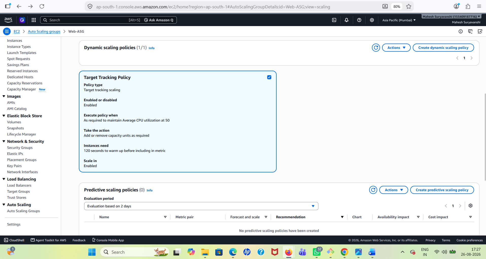

------------------------------------------------------------------------

## Step 17 --- CloudWatch Monitoring

Open:

``` text
CloudWatch → Metrics → EC2
```

Monitor:

``` text
CPUUtilization
```

This metric is used to observe CPU load and validate the scaling
behavior.

### Screenshot

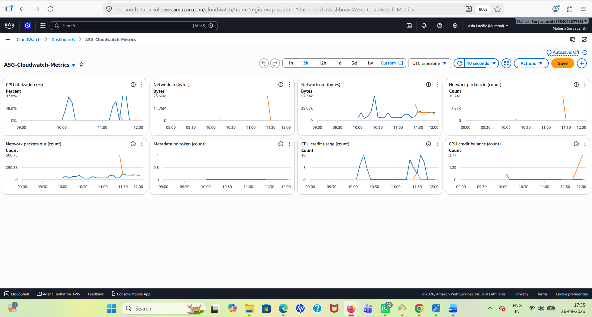

------------------------------------------------------------------------

## Step 18 --- Generate CPU Load

Connect to an EC2 instance.

Install:

``` bash
sudo dnf install stress-ng -y
```

Generate CPU load:

``` bash
stress-ng --cpu 2 --timeout 600s
```

This increases CPU utilization for the scaling test.

### Screenshot

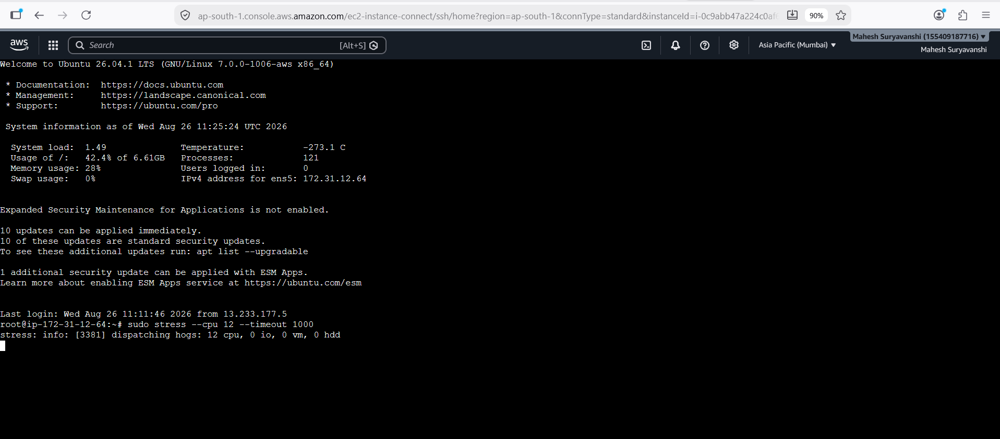

------------------------------------------------------------------------

## Step 19 --- Observe High CPU in CloudWatch

Monitor the CPU utilization graph.

Example:

``` text
20%
  ↓
40%
  ↓
65%
  ↓
80%
```

Once the average CPU utilization remains above the configured target,
the Auto Scaling policy may initiate scale-out.

The exact timing depends on AWS monitoring and scaling evaluation
behavior.

### Screenshot

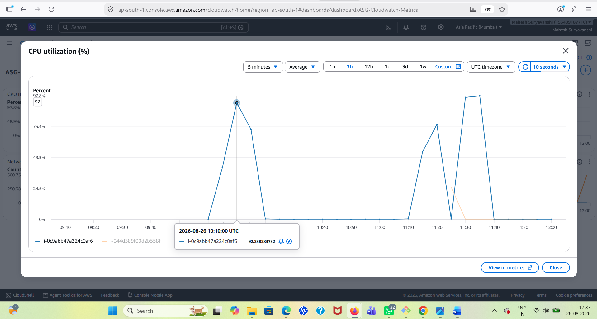

------------------------------------------------------------------------

## Step 20 --- Verify Scale Out

Initially:

``` text
2 EC2 Instances
```

After sustained CPU load, the ASG can increase capacity:

``` text
3 EC2 Instances
```

The actual capacity depends on the scaling policy and current workload.

### Screenshot

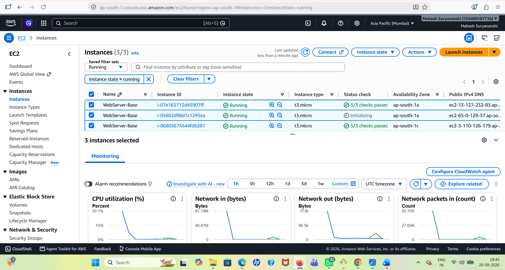

------------------------------------------------------------------------

## Step 21 --- Verify Target Group After Scale Out

Open:

``` text
Target Groups → Web-TG → Targets
```

Expected after a successful scale-out:

``` text
Instance 1 → Healthy
Instance 2 → Healthy
Instance 3 → Healthy
```

### Screenshot

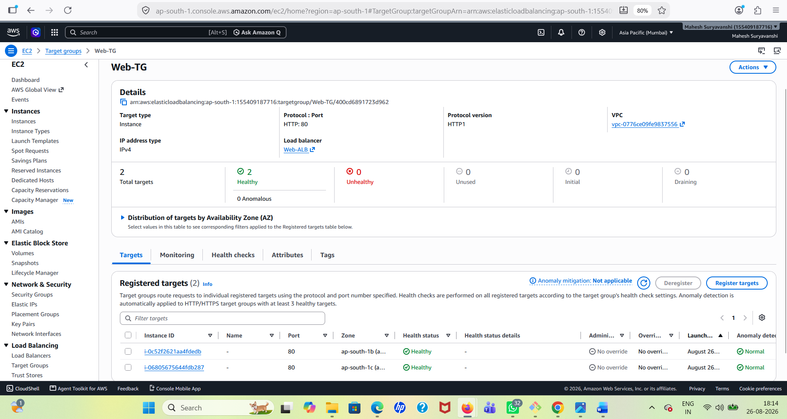

------------------------------------------------------------------------

## Step 22 --- Test ALB After Scale Out

Open the ALB DNS name again.

Refresh the application multiple times.

The ALB can distribute requests among the currently healthy instances.

### Screenshot

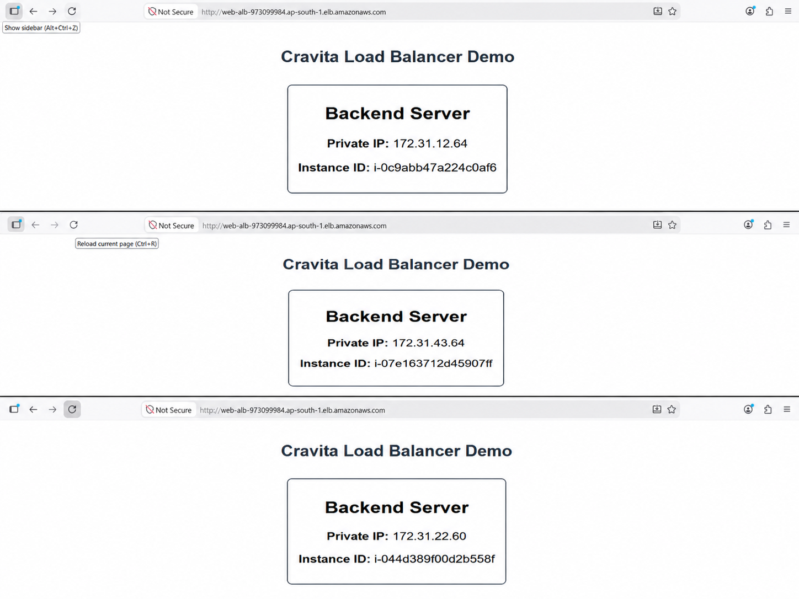

------------------------------------------------------------------------

## Step 23 --- Scale-In Test

Allow the CPU stress command to finish:

``` bash
stress-ng --cpu 2 --timeout 600s
```

After CPU utilization returns to normal, the Auto Scaling Group can
reduce capacity according to the configured scaling policy.

Example:

``` text
High CPU
   ↓
3 instances

Normal CPU
   ↓
2 instances
```

------------------------------------------------------------------------

## Step 24 --- Verify Scale In

Open:

``` text
EC2 → Instances
```

Verify that unnecessary capacity has been removed and the ASG has
returned toward its desired capacity.

### Screenshot

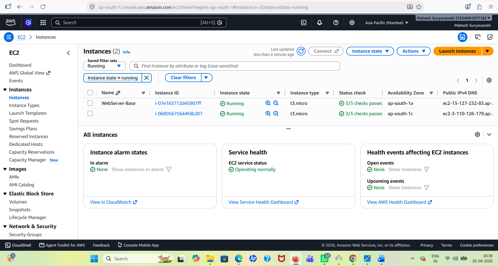

------------------------------------------------------------------------

# High Availability and Failover Test

To verify self-healing, manually terminate one EC2 instance managed by
the Auto Scaling Group.

Expected behavior:

``` text
EC2 Instance Terminated
          |
          v
ALB Health Check
          |
          v
Unhealthy/Removed Target
          |
          v
ASG Detects Capacity Shortage
          |
          v
New EC2 Instance Launched
          |
          v
Target Group Registration
          |
          v
Health Check Passes
          |
          v
Instance InService
```

This demonstrates automatic instance replacement and application
resilience.

------------------------------------------------------------------------

# Screenshot Directory

Store all project screenshots inside:

``` text
screenshots/
```

Recommended structure:

``` text
screenshots/
├── 1-alb-security-group.png
├── 2-ec2-security-group.png
├── 3-ec2-instance.png
├── 4-apache-installed.png
├── 5-demo-website.png
├── 6-ami-created.png
├── 7-launch-template.png
├── 8-target-group.png
├── 9-application-load-balancer.png
├── 10-auto-scaling-group.png
├── 11-two-ec2-instances.png
├── 12-healthy-targets.png
├── 13-alb-website.png
├── 14-load-balancing.png
├── 15-scaling-policy.png
├── 16-cloudwatch-cpu.png
├── 17-cpu-stress.png
├── 18-high-cpu-cloudwatch.png
├── 19-scale-out.png
├── 20-three-healthy-targets.png
├── 21-alb-after-scale-out.png
└── 22-scale-in.png
```

------------------------------------------------------------------------

# Project Validation

The project is considered successfully validated because the following are
demonstrated:

-    ALB is internet-facing and accessible.
-    Two EC2 instances run across different Availability Zones.
-    Target Group reports healthy targets.
-    ALB distributes requests to healthy instances.
-    Auto Scaling Group maintains minimum capacity.
-    CPU-based target tracking scaling is configured.
-    CloudWatch shows CPU utilization.
-    CPU load causes scale-out when the policy conditions are met.
-    Capacity can scale back in after demand decreases.
-    Failed/terminated instances can be replaced by the ASG.

------------------------------------------------------------------------

# Conclusion

This project demonstrates a production-style AWS pattern for handling
changing application traffic.

The combination of:

``` text
Application Load Balancer
        +
Auto Scaling Group
        +
Multi-AZ EC2
        +
CloudWatch
```

provides:

-   High availability
-   Automatic scaling
-   Health-based traffic routing
-   Automatic instance replacement
-   Better resilience during traffic spikes
-   Reduced manual infrastructure management

This architecture is suitable as a practical Cloud/DevOps portfolio
project demonstrating AWS compute, networking, load balancing,
monitoring, and auto-scaling concepts.
